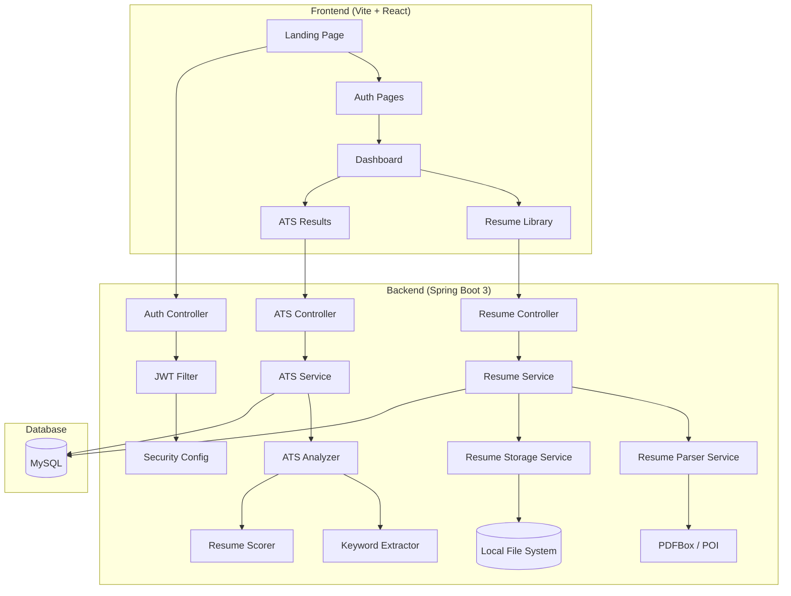

<div align="center">
  <br />
  
  <br />
  <h1 align="center" style="font-size: 3rem; font-weight: 800; letter-spacing: -0.02em; margin-top: 1.5rem;">
    🚀 CareerOS
  </h1>
  <p align="center" style="font-size: 1.2rem; color: #64748b; max-width: 600px; margin: 0.5rem auto;">
    Your intelligent career companion — upload, parse, analyze, and optimize your resume with powerful ATS insights.
  </p>
  <br />

  <div align="center">
    
    
    
    
    
  </div>
  <div align="center">
    
    
    
    
    
  </div>
  <div align="center">
    
    
  </div>

  <br />

  <div align="center">
    
    
    
  </div>

  <br />
</div>

---

## 📖 Project Description

**CareerOS** is a full-stack career management platform that helps professionals take control of their job applications. Upload your resume (PDF or DOCX), let the system extract and analyze its content, and receive actionable ATS optimization suggestions — all without AI or LLM dependency.

Built with a modern **React + TypeScript** frontend and a robust **Spring Boot 3** backend, CareerOS is designed for extensibility, performance, and professional-grade UX.

---

## ✨ Features

| Category | Feature | Status |
|----------|---------|--------|
| 🖥️ **Landing Page** | Premium hero section with animated floating cards, navbar, and trusted companies | ✅ |
| 🔐 **Authentication** | Register / Login with JWT, token refresh, protected routes | ✅ |
| 📄 **Resume Upload** | Drag-and-drop upload, PDF/DOCX validation, 5 MB limit | ✅ |
| 📖 **Resume Library** | Grid & list views, search, tag filtering, sort, rename, delete | ✅ |
| 🔍 **Resume Parsing** | PDFBox & POI extraction, metadata capture, plain text output | ✅ |
| 📊 **ATS Analysis** | Placeholder scoring, keyword extraction, section detection, suggestions | ✅ |
| 📱 **Responsive UI** | Mobile-first design with Framer Motion animations | ✅ |
| 🌙 **Dark Theme** | Premium dark color scheme with glassmorphism effects | ✅ |

---

## 🏗️ Architecture



---

## 📁 Folder Structure

```
CareerOS/
├── frontend/                          # React + TypeScript + Vite
│   ├── public/
│   ├── src/
│   │   ├── app/                       # App shell, providers, router
│   │   ├── assets/                    # Images, icons
│   │   ├── components/
│   │   │   ├── auth/                  # Login, register, protected route
│   │   │   ├── dashboard/             # Sidebar, cards, activity
│   │   │   ├── features/              # Feature highlights
│   │   │   ├── hero/                  # Landing page sections
│   │   │   ├── layout/                # Root layout, shell
│   │   │   ├── resume/                # Upload, library, parser UI
│   │   │   ├── trusted/               # Trusted companies bar
│   │   │   └── ui/                    # Button, Input, Card, Motion
│   │   ├── constants/                 # Routes, UI constants
│   │   ├── contexts/                  # Auth context
│   │   ├── hooks/                     # useAppNavigate, useAxiosError
│   │   ├── layouts/                   # RootLayout, DashboardLayout
│   │   ├── pages/                     # Landing, Auth, Dashboard, Resume
│   │   ├── services/                  # HTTP client, API endpoints
│   │   └── theme/                     # Design system, tokens, Tailwind
│   ├── index.html
│   ├── package.json
│   ├── tailwind.config.ts
│   ├── tsconfig.json
│   └── vite.config.ts
│
├── backend/                           # Spring Boot 3 + Java 17
│   ├── src/main/java/com/careeros/
│   │   ├── auth/                      # Auth controller, service, requests
│   │   ├── config/                    # Application config, Security config
│   │   ├── exception/                 # Global exception handler
│   │   ├── jwt/                       # JWT service, filter
│   │   ├── resume/                    # Resume entity, controller, services
│   │   ├── ats/                       # ATS analyzer, scorer, extractor
│   │   └── user/                      # User entity, repository, service
│   ├── src/main/resources/
│   │   └── application.properties
│   └── pom.xml
│
├── docs/                              # Documentation
│   ├── architecture.md
│   └── api.md
├── scripts/                           # Utility scripts
├── .gitignore
├── LICENSE
└── README.md
```

---

## 🛠️ Installation Guide

### Prerequisites

| Tool | Version | 
|------|---------|
| Node.js | >= 18.x |
| npm | >= 9.x |
| Java | >= 17 |
| Maven | >= 3.8 |
| MySQL | >= 8.0 |
| Git | >= 2.x |

---

### 🔧 Backend Setup

```bash
# 1. Clone the repository
git clone https://github.com/your-username/careeros.git
cd careeros

# 2. Create MySQL database
mysql -u root -p -e "CREATE DATABASE IF NOT EXISTS careeros;"

# 3. Navigate to backend
cd backend

# 4. Configure environment variables
# Edit src/main/resources/application.properties with your MySQL credentials:
# spring.datasource.username=root
# spring.datasource.password=your_password

# 5. Build and run
mvn clean install
mvn spring-boot:run
```

The backend starts at **http://localhost:8080**.

---

### 🎨 Frontend Setup

```bash
# 1. From project root, navigate to frontend
cd frontend

# 2. Install dependencies
npm install

# 3. Start development server
npm run dev
```

The frontend starts at **http://localhost:5173**.

---

## 🌐 Environment Variables

### Backend (`application.properties`)

| Variable | Description | Default |
|----------|-------------|---------|
| `server.port` | Server port | `8080` |
| `spring.datasource.url` | MySQL JDBC URL | `jdbc:mysql://localhost:3306/careeros` |
| `spring.datasource.username` | MySQL username | `root` |
| `spring.datasource.password` | MySQL password | `root` |
| `application.security.jwt.secret-key` | JWT signing key | *(auto-generated)* |
| `application.security.jwt.expiration` | JWT expiry (ms) | `86400000` (24h) |
| `application.resume.upload-dir` | Resume file storage | `uploads` |

---

## 📋 API Overview

### Authentication

| Method | Endpoint | Description |
|--------|----------|-------------|
| `POST` | `/api/v1/auth/register` | Register a new user |
| `POST` | `/api/v1/auth/authenticate` | Login and receive JWT |

### Resume Management

| Method | Endpoint | Description |
|--------|----------|-------------|
| `POST` | `/api/v1/resume/upload` | Upload a resume (PDF/DOCX) |
| `GET` | `/api/v1/resume` | List user's resumes |
| `GET` | `/api/v1/resume/{id}` | Get specific resume |
| `DELETE` | `/api/v1/resume/{id}` | Delete a resume |

### ATS Analysis

| Method | Endpoint | Description |
|--------|----------|-------------|
| `GET` | `/api/v1/ats/analyze/{resumeId}` | Analyze uploaded resume |
| `POST` | `/api/v1/ats/analyze/text` | Analyze raw text |

> Full API documentation → [docs/api.md](./docs/api.md)

---

## ✅ Current Features

- ✅ Premium landing page with hero, animations, and floating cards
- ✅ User registration and login with JWT-based authentication
- ✅ Protected routes and auth context on the frontend
- ✅ Resume upload with PDF/DOCX validation, 5 MB limit, drag-and-drop
- ✅ Resume library with grid/list views, search, tag filtering, sort, rename, delete
- ✅ Resume parsing via Apache PDFBox (PDF) and Apache POI (DOCX)
- ✅ ATS analysis architecture with modular scorer, keyword extractor, and suggestion engine
- ✅ Professional design system with dark theme and glassmorphism components

---

## 🔮 Upcoming Features

- 🔲 **Job Description Matching** — Compare resume against job descriptions
- 🔲 **Keyword Gap Analysis** — Identify missing keywords for target roles
- 🔲 **Batch Resume Upload** — Upload and analyze multiple resumes at once
- 🔲 **Export Reports** — Download ATS analysis as PDF
- 🔲 **Resume Templates** — Built-in templates for quick formatting
- 🔲 **Application Tracking** — Track job applications and statuses
- 🔲 **Team Collaboration** — Share resumes and feedback with team members
- 🔲 **Real ATS Scoring** — Replace placeholders with actual algorithmic scoring

---

## 📸 Screenshots

> Screenshots coming soon. Stay tuned!

| Landing Page | Dashboard | Resume Library |
|-------------|-----------|----------------|
| *Coming soon* | *Coming soon* | *Coming soon* |

---

## 🤝 Contributing

Contributions are what make the open-source community such an amazing place to learn, inspire, and create. Any contributions you make are **greatly appreciated**.

1. Fork the Project
2. Create your Feature Branch (`git checkout -b feature/AmazingFeature`)
3. Commit your Changes (`git commit -m 'Add some AmazingFeature'`)
4. Push to the Branch (`git push origin feature/AmazingFeature`)
5. Open a Pull Request

Please ensure your code follows the existing style and passes all checks.

---

## 📄 License

Distributed under the **MIT License**. See `LICENSE` for more information.

---

<div align="center">
  <br />
  <p>
    Built with ❤️ using <strong>React</strong>, <strong>Spring Boot</strong>, and lots of ☕
  </p>
  <p>
    <a href="https://github.com/your-username/careeros/issues">Report Bug</a>
    ·
    <a href="https://github.com/your-username/careeros/issues">Request Feature</a>
  </p>
  <br />
</div>

